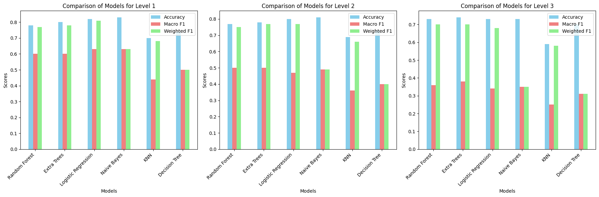

# Hierarchical Product Classification Using Machine Learning

# Table of Contents
Project Overview
Dataset Description
Model Pipeline
Key Features
Installation and Setup
Preprocessing and Feature Engineering
Models and Hyperparameter Tuning
Results and Evaluation
Future Work
Contributors

# Project Overview
This project aims to build a hierarchical classification system to categorize products into three levels of granularity:

**Level 1**: Broad categories (e.g., Electronics, Clothing).
**Level 2**: Subcategories within Level 1 (e.g., Mobile Phones under Electronics).
**Level 3**: Specific product types (e.g., iPhone 13).

Machine learning models, including Random Forest, Extra Trees, Logistic Regression, Naive Bayes, KNN, and Decision Trees, were used. The models were trained, evaluated, and optimized to achieve high accuracy, macro F1, and weighted F1 scores.

# Dataset Description
The dataset contains 8,361 records, representing e-commerce product data. It includes:

**Textual Features**: Product title, description, and breadcrumbs.
**Categorical Features**: Brand and category labels.
**Numerical Features**: Description length.

The dataset exhibits class imbalance, particularly in deeper levels, where certain categories dominate.

# Dataset Structure

**GS1_Level1_Category**: Broad product categories.
**GS1_Level2_Category**: Subcategories under Level 1.
**GS1_Level3_Category**: Granular product types.

# Model Pipeline
The project follows a robust pipeline architecture:

**Data Preprocessing**:

Text vectorization using TF-IDF.
Categorical encoding with One-Hot Encoding.
Numerical feature scaling with StandardScaler.

**Feature Engineering**:

Dimensionality reduction techniques.
Creation of contextual features.

**Model Training and Tuning**:

Hyperparameter tuning via GridSearchCV.
Hierarchical prediction with level-wise dependency.

**Evaluation**:

Metrics include accuracy, macro F1, and weighted F1 scores.
**Key Features**
Multi-output classification for hierarchical levels.
Hyperparameter optimization with GridSearchCV.
Custom evaluation metrics for imbalanced data handling.
Automated pipelines for preprocessing and model tuning.

# Preprocessing and Feature Engineering

**Preprocessing Steps**

**Text Features**:

Applied TF-IDF Vectorization with unigrams and bigrams.
Limited maximum features to prevent sparsity.

**Categorical Features**:
Used One-Hot Encoding for s:brand and s:category.

**Numerical Features**:
Standardized description_length using Z-score normalization.

# Feature Engineering
Contextual features such as brand-frequency and category-breadcrumb were created to improve classification accuracy.

# Models and Hyperparameter Tuning

**Models Used**
*Random Forest*
*Extra Trees*
*Logistic Regression*
*Naive Bayes*
*KNN*
*Decision Trees*

# Hyperparameter Tuning

Random Forest: Number of trees (n_estimators), tree depth (max_depth), and splitting criteria.
KNN: Number of neighbors (k) and distance metric (e.g., Euclidean).
Naive Bayes: Smoothing parameter (alpha).
Logistic Regression: Regularization parameter (C) and penalty type.

# Results and Evaluation
**Key Metrics**
Accuracy:
Best Level 1: Naive Bayes (83%)
Best Level 2: Naive Bayes (81%)
Macro F1:
Best Level 1: Logistic Regression (0.63)
Best Level 3: Extra Trees (0.38)
Weighted F1:
Stable across ensemble models like Random Forest and Extra Trees.

# Combined Visualization
Performance trends across metrics (accuracy, macro F1, and weighted F1) are visualized for easy comparison.

# Future Work
Incorporate Transfer Learning using pre-trained embeddings like BERT.
Explore deep learning models (e.g., Transformers) for hierarchical tasks.
Develop hybrid approaches for conflicting predictions.
Introduce feedback loops for real-time performance monitoring.
